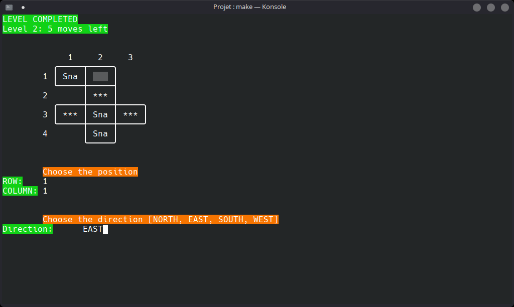

# ESI - DEV2 PROJET - HUMBUG




## How to play


## Structure du projet
```
.
├── src
│   ├── main
│   │   ├── java
│   │   │   └── g54327
│   │   │       ├── humbug
│   │   │       │   ├── controller
│   │   │       │   │   └── Controller.java
│   │   │       │   ├── model
│   │   │       │   │   ├── Animals
│   │   │       │   │   │   ├── Type
│   │   │       │   │   │   │   ├── Aerial.java
│   │   │       │   │   │   │   └── Terrestrial.java
│   │   │       │   │   │   ├── Animal.java
│   │   │       │   │   │   ├── Bumblebee.java
│   │   │       │   │   │   ├── Butterfly.java
│   │   │       │   │   │   ├── Grasshopper.java
│   │   │       │   │   │   ├── Ladybird.java
│   │   │       │   │   │   ├── Snail.java
│   │   │       │   │   │   └── Spider.java
│   │   │       │   │   ├── Exceptions
│   │   │       │   │   │   ├── AnimalDiesException.java
│   │   │       │   │   │   ├── LevelNotStartedException.java
│   │   │       │   │   │   ├── NoLevelLeftException.java
│   │   │       │   │   │   ├── NullPositionException.java
│   │   │       │   │   │   ├── NullSquareException.java
│   │   │       │   │   │   └── PositionOutOfBoundException.java
│   │   │       │   │   ├── Levels
│   │   │       │   │   │   ├── Level.java
│   │   │       │   │   │   └── LevelStatus.java
│   │   │       │   │   ├── Squares
│   │   │       │   │   │   ├── Square.java
│   │   │       │   │   │   └── SquareType.java
│   │   │       │   │   ├── Structures
│   │   │       │   │   │   ├── Board.java
│   │   │       │   │   │   ├── Direction.java
│   │   │       │   │   │   └── Position.java
│   │   │       │   │   ├── Game.java
│   │   │       │   │   └── Model.java
│   │   │       │   ├── view
│   │   │       │   │   └── text
│   │   │       │   │       ├── Grid.java
│   │   │       │   │       ├── InterfaceView.java
│   │   │       │   │       └── View.java
│   │   │       │   └── Main.java
│   │   │       └── utils
│   │   │           └── RobustScanner.java
│   │   └── resources
│   │       └── data
│   │           ├── level-1.json
│   │           ├── ...
│   │           ├── level-47.json
│   │           ├── level-69.json
│   │           └── level-100.json
│   └── test
│       └── java
│           ├── g54327
│           │   └── humbug
│           │       ├── model
│           │       │   └── Animals
│           │       │       ├── BumblebeeTest.java
│           │       │       ├── ButterflyTest.java
│           │       │       ├── GrasshopperTest.java
│           │       │       ├── LadybirdTest.java
│           │       │       ├── SnailTest.java
│           │       │       └── SpiderTest.java
│           │       └── MainTest.java
│           └── pbt
│               └── humbug
│                   └── model
│                       ├── animals
│                       │   ├── SnailTest.java
│                       │   └── SpiderTest.java
│                       ├── BoardTest.java
│                       └── PositionTest.java
├── statement
│   ├── consignes-projet.pdf
│   ├── enonce-1.pdf
│   └── enonce-2.pdf
├── DEV2-PROJECT.iml
├── LICENSE
├── Makefile
├── pom.xml
└── README.md
```

## Documentation
Vérifiez la documentation [ici](https://asassoye.github.io/ESI-dev2-project/index.html)

## Compiler
### Maven
Pour compiler le projet, executer :
```
mvn build
```

## Package
### Maven
Pour compiler le projet, executer :
```
mvn package
```

Puis executez:
```
java -jar target/humbug-2.0.0.jar
```

## Tests
### Maven
Pour executer les testes, executer la commande:
```
mvn test 
```
